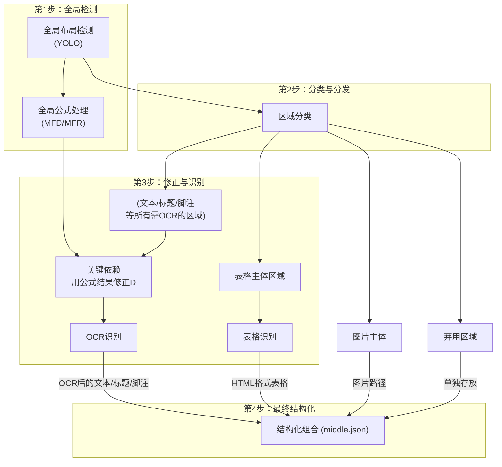

# MinerU解析流程

MinerU当前支持word、ppt、pdf、图片的解析。

MinerU只开源了解析PDF的代码，从作者团队其他的一个实现word、ppt、pdf解析的项目[magic-doc](https://github.com/opendatalab/magic-doc)来看，对于这三者是分类型处理的且流程高度不同。

对于前两者，我们有原生的详细位置和内容信息，只需简单调用格式转化的库函数就可以实现。

对于PDF，解析方法会相对复杂很多（猜想图片的处理也是和PDF高度相似的）。

PDF解析有两个可选的完全独立的过程，也就是用**专用模型分类别解析（pipeline）**和**VLM解析**。

docling的解析架构和上述内容也是高度一致，最大的不同点可能是docling不像MinerU输出直接为JSON,而是自定义一个结构体来统一所有格式文件的初步转化结果。

# pipeline后端处理流程

1. PDF输入

2. 预处理

3. 布局检测 ：分类页面区域

4. 调用模型 ：分类调用模型处理

5. 结构化输出 ：输出JSON结构和MD格式

## 预处理：

#### **判断是否使用OCR**：

```python
# 1.每页平均少于50个有效字符（pdfium库）2.存在非法字符（pdfminer库）
if (get_avg_cleaned_chars_per_page(pdf, pages_to_check) < chars_threshold) or detect_invalid_chars(sample_pdf_bytes):
    return 'ocr'
else:
    # 3.图片覆盖率大于80% （pdfminer库）
    if get_high_image_coverage_ratio(sample_pdf_bytes, pages_to_check) >= 0.8:
        # 满足以上任意条件则判断为扫描PDF
        return 'ocr'
    # 对于原生PDF则使用PyMuPDF库进行读取
    return 'txt'
```

以上三点中，满足以上任意一点则将PDF文件判断为扫描件。

库使用说明：

| **pdfium库**           | **pdfminer库**                           | PyMuPDF库              |
| ---------------------- | ---------------------------------------- | ---------------------- |
| 快速，适合初步文本统计 | 准确，能够对于异常字符和图片进行稳定判断 | 性能介中，适合批量处理 |

以上是否进行OCR处理是随机抽取十页进行以上流程，对于整个文档实现统一的处理方式。

如果我们确定了PDF类别，例如全部为年报我们就可以直接判定为原生PDF，忽略以上这个判断环节。

## 布局检测：

1. 进行区域分割（使用矩形检测框）（YOLO算法，神经网络），以十五（0\~14）个初始类别进行分类（剩下三个是处理后得到的类别）

```python
class CategoryId:
    Title = 0  # 标题
    Text = 1  # 正文文本
    Abandon = 2  # 弃用/废弃内容
    ImageBody = 3  # 图片主体
    ImageCaption = 4  # 图片标题/说明
    TableBody = 5  # 表格主体
    TableCaption = 6  # 表格标题/说明
    TableFootnote = 7  # 表格脚注
    InterlineEquation_Layout = 8  # 行间公式（版面检测）
    InterlineEquationNumber_Layout = 9  # 行间公式编号（版面检测）
    InlineEquation = 13  # 行内公式
    InterlineEquation_YOLO = 14  # 行间公式（YOLO检测）
    OcrText = 15  # OCR识别文本
    LowScoreText = 16  # 低置信度文本
    ImageFootnote = 101  # 图片脚注
```

对于以上十二类，我们再缩分为以下六类

1. 公式区域 &#x20;

2. OCR区域 &#x20;

3. 表格区域&#x20;

4. 文本区域&#x20;

5. 图片区域

6. 弃用区域&#x20;

前五类分别调用四类对应的模型来进行处理（图片归类于OCR区域）。弃用区域直接使用规则处理。

```python
# 公式区域 (13, 14)
if category_id in [13, 14]:  # Formula regions
    single_page_mfdetrec_res.append({...})

# OCR区域 (0, 2, 4, 6, 7, 3)
elif category_id in [0, 2, 4, 6, 7, 3]:  # OCR regions
    ocr_res_list.append(res)

# 表格区域 (5)
elif category_id == 5:  # Table regions
    table_res_list.append(res)

# 文本区域 (1)
elif category_id in [1]:  # Text regions
    text_res_list.append(res)
```

对于OCR区域 (0, 2, 4, 6, 7, 3)和文本区域 (1)，我们基本统一都是使用OCR处理，唯二的不同点是

对于文本区域 (1)我们会在OCR处理后进行检测框优化，然后统一作为需要进行OCR的材料。

```python
def remove_overlaps_min_blocks(res_list):
    # 嵌套block，小的不能直接删除，需要和大的那个合并成一个更大的。
    # 删除重叠blocks中较小的那些
```

如果检测为原生PDF，我们会使用PyMuPDF库读取文本区域 (1)，如果效果差才会使用OCR兜底。

```python
# 在model_json_to_middle_json.py中，文本区域在这里处理
def page_model_info_to_page_info(...):
    # 文本区域的处理
    if ocr_enable:
        pass  # 如果启用OCR，文本区域也会被OCR处理
    else:
        # 使用pdfium + 必要时OCR的混合方案
        spans = txt_spans_extract(page, spans, page_pil_img, scale, all_bboxes, all_discarded_blocks)
```

我们详细的流程图如下。



以下我们分类别介绍解析过程。

## 公式：

#### 公式检测（MFD）：

确定公式位置，并分类为行内和行间公式（**YOLOv8MFDModel**）。

公式处理和其他部分处理相比，非常特殊的一点是没有从YOLO分类时得到的行内和行间公式出发，而使用模型（**YOLOv8MFDModel**）重新对于整个页面进行识别提取，重新确定了公式的位置和类别。

猜想可能是YOLO模型的识别精度不够，所以使用**YOLOv8MFDModel**进一步完善。

```python
class YOLOv8MFDModel:
    def __init__(
    ):
    def _run_predict(
        )
        return [pred.cpu() for pred in preds] if is_batch else preds[0].cpu()

    def predict(self, image: Union[np.ndarray, Image.Image]):
        return self._run_predict(image)

    def batch_predict(
    ) 
        return results
```

#### 公式识别（MFR）：

基于**MFD**检测到的结果，识别公式（**UnimernetModel**），输出latex格式。

```python
class UnimernetModel(object):
    def predict(self, mfd_res, image):
    def batch_predict(self, images_mfd_res: list, images: list, batch_size: int = 64):
```

## 文本：

#### 前置处理：

对于文本区域（1），我们首先对于YOLO算法检测到的文本区域和我们在公式检测中得到行内公式区域，解决重叠的问题，得到除去公式内容后OCR可以识别的文本。

```python
def update_det_boxes(dt_boxes, mfd_res):
    new_dt_boxes = []
    angle_boxes_list = []
    for text_box in dt_boxes:

        if calculate_is_angle(text_box):
            angle_boxes_list.append(text_box)
            continue

        text_bbox = points_to_bbox(text_box)
        masks_list = []
        for mf_box in mfd_res:
            mf_bbox = mf_box['bbox']
            if _is_overlaps_y_exceeds_threshold(text_bbox, mf_bbox):
                masks_list.append([mf_bbox[0], mf_bbox[2]])
        text_x_range = [text_bbox[0], text_bbox[2]]
        text_remove_mask_range = remove_intervals(text_x_range, masks_list)
        temp_dt_box = []
        for text_remove_mask in text_remove_mask_range:
            temp_dt_box.append(bbox_to_points([text_remove_mask[0], text_bbox[1], text_remove_mask[1], text_bbox[3]]))
        if len(temp_dt_box) > 0:
            new_dt_boxes.extend(temp_dt_box)

    new_dt_boxes.extend(angle_boxes_list)

    return new_dt_boxes
```

#### OCR识别：

对OCR区域 (0, 2, 4, 6, 7, 3)和文本区域 (1)（如果确认为扫描PDF）进行OCR处理。

这里的处理较复杂，例如大框覆盖小框等情况需要考虑。

（参考文件MinerU-master\mineru\model\ocr\paddleocr2pytorch\pytorch\_paddle.py）

## 图片：

#### 图片检测：

YOLO模型已经完成了图片区域的定位，无需额外的检测步骤。

#### 图片关联处理：

首先进行距离匹配：使用tie\_up\_category\_by\_distance\_v3、tie\_up\_category\_by\_distance\_v3函数将图片主体与标题和脚注基于最近距离关系进行匹配。

接着分组构建：将匹配成功的图片主体、标题、脚注组合成一个group（每个group包含：image\_body、image\_caption\_list、image\_footnote\_list）。使用group\_id字段标注这三个内容。

```python
def get_imgs(self):
    # 图片主体与标题关联
    with_captions = self.__tie_up_category_by_distance_v3(
        CategoryId.ImageBody, CategoryId.ImageCaption
    )
    # 图片主体与脚注关联  
    with_footnotes = self.__tie_up_category_by_distance_v3(
        CategoryId.ImageBody, CategoryId.ImageFootnote
    )
    
    # 构建完整的图片组
    for v in with_captions:
        record = {
            'image_body': v['sub_bbox'],
            'image_caption_list': v['obj_bboxes'],
            'image_footnote_list': d['obj_bboxes']  # 对应的脚注
        }
```

对于图片本身我们进行OCR处理且保留地址（但是在最后输出时图片的OCR结果只保留在中间环节的JSON中，在最终输出的MD中舍去了这部分内容），而对于图片对应的标题和脚注会进行OCR处理来得到文字。后续我们对于表格的标题和脚注也是这么处理。

```python
# 对标题和脚注的子块进行OCR处理
if sub_block['type'] in ['image_caption', 'image_footnote', 'table_caption', 'table_footnote']:
    text_block_list.append(sub_block)  # 只有标题和脚注进入OCR处理
```

## 表格：

#### 前置处理：

先对表格进行高IoU表格合并（合并高度重叠的表格），IoU=交集面积占并集面积的比例。

类似基于IoU的处理在文本块、标题块、公式块中都有用到。

```python
def calculate_iou(bbox1, bbox2):
    """计算两个边界框的交并比(IOU)。
    
    Args:
        bbox1 (list[float]): 第一个边界框的坐标，格式为 [x1, y1, x2, y2]
        bbox2 (list[float]): 第二个边界框的坐标，格式与 `bbox1` 相同。
    
    Returns:
        float: 两个边界框的交并比(IOU)，取值范围为 [0, 1]。
    """
    # 计算交集区域的坐标
    x_left = max(bbox1[0], bbox2[0])
    y_top = max(bbox1[1], bbox2[1])
    x_right = min(bbox1[2], bbox2[2])
    y_bottom = min(bbox1[3], bbox2[3])
    
    if x_right < x_left or y_bottom < y_top:
        return 0.0
    
    # 交集面积
    intersection_area = (x_right - x_left) * (y_bottom - y_top)
    
    # 两个矩形的面积
    bbox1_area = (bbox1[2] - bbox1[0]) * (bbox1[3] - bbox1[1])
    bbox2_area = (bbox2[2] - bbox2[0]) * (bbox2[3] - bbox2[1])
    
    # IoU = 交集面积 / 并集面积
    iou = intersection_area / float(bbox1_area + bbox2_area - intersection_area)
    
    return iou
```

接着进行嵌套表格合并，去除掉嵌套中的小表格。

```python
def filter_nested_tables(table_res_list, overlap_threshold=0.8, area_threshold=0.8):
    """Remove big tables containing multiple smaller tables within them."""
    for i in range(len(table_res_list)):
        # 找到包含在当前表格内的其他表格
        tables_inside = [j for j in range(len(table_res_list))
                         if i != j and is_inside(table_info[j], table_info[i], overlap_threshold)]
        
        # 如果内部有至少3个表格
        if len(tables_inside) >= 3:
            # 检查内部表格之间是否重叠
            tables_overlap = any(do_overlap(table_info[tables_inside[idx1]], table_info[tables_inside[idx2]])
                                 for idx1 in range(len(tables_inside))
                                 for idx2 in range(idx1 + 1, len(tables_inside)))
            
            # 如果内部表格不重叠，检查面积条件
            if not tables_overlap:
                total_inside_area = sum(table_info[j][4] for j in tables_inside)
                big_table_area = table_info[i][4]
                
                if total_inside_area > area_threshold * big_table_area:
                    big_tables_idx.append(i)  # 标记大表格为需要删除
```

#### 表格识别：

使用**RapidTableModel**和**SlanetPlus**模型对表格进行结构化识别，输出HTML格式：

**SlanetPlus：**专门负责表格结构识别（行列、单元格边界）

**OCR引擎**：负责识别单元格中的文本内容

**RapidTable**：作为框架整合上述组件，输出最终的HTML表格结构

```python
# 表格识别 table recognition
if self.table_enable:
    for table_res_dict in tqdm(table_res_list_all_page, desc="Table Predict"):
        _lang = table_res_dict['lang']
        table_model = atom_model_manager.get_atom_model(
            atom_model_name='table',
            lang=_lang,
        )
        html_code, table_cell_bboxes, logic_points, elapse = table_model.predict(table_res_dict['table_img'])
```

#### **表格关联处理**：

```python
def get_tables(self) -> list:
    # 表格主体与标题关联
    with_captions = self.__tie_up_category_by_distance_v3(
        CategoryId.TableBody, CategoryId.TableCaption
    )
    # 表格主体与脚注关联
    with_footnotes = self.__tie_up_category_by_distance_v3(
        CategoryId.TableBody, CategoryId.TableFootnote  
    )
    
    # 构建完整的表格组
    ret = []
    for v in with_captions:
        record = {
            'table_body': v['sub_bbox'],
            'table_caption_list': v['obj_bboxes'],
            'table_footnote_list': d['obj_bboxes']  # 对应的脚注
        }
```

## 弃用内容：

#### 弃用内容标记：

对于YOLO模型标记为`CategoryId.Abandon`的区域（2），以及OCR识别置信度过低的内容（16），系统将其标记为弃用：

```python
def get_discarded(self) -> list:
    # 获取废弃区块
    blocks = self.__get_blocks_by_type(CategoryId.Abandon)
    return blocks

# 低置信度内容处理
if ocr_score < OcrConfidence.min_confidence:
    layout_res_item['category_id'] = 16  # 标记为废弃
```

#### 弃用内容处理：

弃用内容不参与后续的语义分析和结构化组织，但会在后续的JSON结构中单独记录：

```python
# 弃用区块单独处理
discarded_block_with_spans, spans = fill_spans_in_blocks(
    all_discarded_blocks, spans, 0.4
)
fix_discarded_blocks = fix_discarded_block(discarded_block_with_spans)

# 在页面信息中记录
page_info = {
    'preproc_blocks': blocks,
    'discarded_blocks': fix_discarded_blocks,  # 弃用内容单独存储
    'page_idx': page_id,
    'page_size': [page_w, page_h],
}
```

# VLM后端处理流程

1. 输入PDF

2. 将PDF转为图片

3. 使用VLM直接识别图片，令其输出JSON

```python
def doc_analyze(
    pdf_bytes,
    image_writer: DataWriter | None,
    predictor: BasePredictor | None = None,
    backend="transformers",
    model_path: str | None = None,
    server_url: str | None = None,
    **kwargs,
):
    # 1. PDF转图片
    images_list, pdf_doc = load_images_from_pdf(pdf_bytes)
    images_base64_list = [image_dict["img_base64"] for image_dict in images_list]
    
    # 2. 使用VLM直接识别图片
    results = predictor.batch_predict(images=images_base64_list)
    
    # 3. 转换为中间JSON格式
    middle_json = result_to_middle_json(results, images_list, pdf_doc, image_writer)
    return middle_json, results
```

# MinerU 输出文件说明

这一部分在**MinerU-master\docs\zh\reference\output\_files.md**文件中叙述的很详细。

各阶段文件：

1. model.json（Pipeline原始输出）/model\_output.txt（VLM的原始输出）
2. middle.json
3. content\_list.json
4. \*.md

| json文件           | 相较MD增加信息                                               |
| ------------------ | ------------------------------------------------------------ |
| model.json         | 页眉页脚页码和页面大小、行间公式的标号、对象坐标、置信度和HTML LATEX解析格式、图片的OCR结果 |
| model\_output.txt  | 页码、对象坐标                                               |
| middle.json        | 页码和页面大小、丢弃数据、分段前信息、对象坐标、置信度、图片的OCR结果 |
| content\_list.json | 页码                                                         |

#### middle.json

接下来，我们从model.json（Pipeline原始输出）/model\_output.txt（VLM的原始输出）进一步得到middle.json。

可以通过分析垂直距离，上一段内容是否用逗号结尾等规则，实现跨页段落合并。

```python
def para_split(pdf_info: list):
    for page_info in pdf_info:
        blocks = page_info.get('preproc_blocks')
        # ... (此处省略了计算平均行高、字号等初始化代码) ...
        
        para_blocks = []
        i = 0
        while i < len(blocks):
            current_para_blocks = [blocks[i]]
            j = i + 1
            while j < len(blocks):
                block1 = blocks[j - 1]
                block2 = blocks[j]

                # --- 核心判断逻辑 ---
                # 1. 强制不合并的规则 (间距过大, 类型不同, 缩进变化等)
                if force_no_para(block1, block2, avg_line_height, avg_char_width):
                    break
                
                # 2. 强制合并的规则 (如行尾是连字符'-')
                elif force_para(block1, block2):
                    current_para_blocks.append(block2)
                
                # 3. 常规合并规则：垂直间距小且水平对齐
                elif is_v_distance_short(v_distance, avg_line_height) and \
                     is_h_aligned(block1, block2, avg_char_width):
                    current_para_blocks.append(block2)
                else:
                    break # 不满足任何合并条件，则切分段落
                
                j += 1
            # --- 逻辑结束 ---

            # 将合并后的 block 组构造成一个新的 para_block
            para_blocks.append(create_para_block_from_sub_blocks(current_para_blocks))
            i = j
            
        page_info['para_blocks'] = para_blocks
```

可以选择接入LLM模型，分析被标记为 "title" 的块的标题层次。

```python
try:
    # 调用 OpenAI API，发送包含标题信息和指令的 Prompt
    completion = client.chat.completions.create(
        model=title_aided_config["model"],
        messages=[{'role': 'user', 'content': title_optimize_prompt}],
        temperature=0.7,
        stream=True,
    )
    # ... (此处省略流式接收响应并拼接为 content 字符串的代码)
    
    # 使用 json_repair 解析 LLM 返回的层级字典，增强容错性
    dict_completion = json_repair.loads(content)

    # 将 LLM 分析出的层级更新回原始的标题数据块中
    if len(dict_completion) == len(title_dict):
        for i, origin_title_block in enumerate(origin_title_list):
            origin_title_block["level"] = int(dict_completion[i])
        break # 成功则跳出重试循环
except Exception as e:
    logger.exception(e)
    retry_count += 1 # 失败则记录并准备重试
```

块结构层次：

```json
一级块 (table | image)
└── 二级块
    └── 行 (line)
        └── 片段 (span)
```

例如，对于一个文本，我们会将其划分为多行（line），而对于一行中可能会出现的多字体或是行内公式这样格式不统一的情况，再使用span细分，数据储存在span中。

```json
{
    "pdf_info": [
        {
            "preproc_blocks": [
                {
                    "type": "text",
                    "bbox": [
                        52,
                        61.956024169921875,
                        294,
                        82.99800872802734
                    ],
                    "lines": [
                        {
                            "bbox": [
                                52,
                                61.956024169921875,
                                294,
                                72.0000228881836
                            ],
                            "spans": [
                                {
                                    "bbox": [
                                        54.0,
                                        61.956024169921875,
                                        296.2261657714844,
                                        72.0000228881836
                                    ],
                                    "content": "dependent on the service headway and the reliability of the departure ",
                                    "type": "text",
                                    "score": 1.0
                                }
                            ]
                        }
                    ]
                }
            ],
            "layout_bboxes": [
                {
                    "layout_bbox": [
                        52,
                        61,
                        294,
                        731
                    ],
                    "layout_label": "V",
                    "sub_layout": []
                }
            ],
            "page_idx": 0,
            "page_size": [
                612.0,
                792.0
            ],
            "_layout_tree": [],
            "images": [],
            "tables": [],
            "interline_equations": [],
            "discarded_blocks": [],
            "para_blocks": [
                {
                    "type": "text",
                    "bbox": [
                        52,
                        61.956024169921875,
                        294,
                        82.99800872802734
                    ],
                    "lines": [
                        {
                            "bbox": [
                                52,
                                61.956024169921875,
                                294,
                                72.0000228881836
                            ],
                            "spans": [
                                {
                                    "bbox": [
                                        54.0,
                                        61.956024169921875,
                                        296.2261657714844,
                                        72.0000228881836
                                    ],
                                    "content": "dependent on the service headway and the reliability of the departure ",
                                    "type": "text",
                                    "score": 1.0
                                }
                            ]
                        }
                    ]
                }
            ]
        }
    ],
    "_backend": "pipeline",
    "_version_name": "0.6.1"
}
```

接着我们会基于内容的位置，使用XY-Cut 算法，来实现对于内容阅读顺序的排序，得到content\_list.json。

```python
def sort_blocks_by_bbox(blocks, page_w, page_h, footnote_blocks):
    """
    根据bbox对blocks进行排序，智能判断单栏还是多栏
    """
    # 1. 首先分离脚注、页眉、页脚
    body_blocks, headers, footers = split_body_and_header_footer(
        blocks, page_w, page_h, footnote_blocks
    )

    # 2. 判断是否为复杂布局（多栏）
    if is_complex_layout(body_blocks, page_w, page_h):
        # 2.1 如果是，则使用XY-Cut算法对主体内容进行排序
        try:
            sorted_body_blocks = xycut(body_blocks)
        except Exception:
            # 如果XY-Cut失败，回退到简单的从上到下排序
            sorted_body_blocks = sort_blocks_by_y_then_x(body_blocks)
    else:
        # 2.2 如果是简单布局，直接从上到下，从左到右排序
        sorted_body_blocks = sort_blocks_by_y_then_x(body_blocks)

    # 3. 最后，按 页眉 -> 主体 -> 页脚 的顺序重新组合所有blocks
    return headers + sorted_body_blocks + footers
```

#### content\_list.json

内容类型：

文本层级标识：

通过 `text_level` 字段区分文本层级：

* 无 `text_level` 或 `text_level: 0`：正文文本
* `text_level: 1`：一级标题
* `text_level: 2`：二级标题
* 以此类推...

通用字段：

所有内容块都包含 `page_idx` 字段，表示所在页码（从 0 开始）。

示例数据：

```json
[
        {
        "type": "text",
        "text": "The response of flow duration curves to afforestation ",
        "text_level": 1,
        "page_idx": 0
    },
    {
        "type": "text",
        "text": "Received 1 October 2003; revised 22 December 2004; accepted 3 January 2005 ",
        "page_idx": 0
    },
    {
        "type": "text",
        "text": "Abstract ",
        "text_level": 2,
        "page_idx": 0
    },
    {
        "type": "text",
        "text": "The hydrologic effect of replacing pasture or other short crops with trees is reasonably well understood on a mean annual basis. The impact on flow regime, as described by the annual flow duration curve (FDC) is less certain. A method to assess the impact of plantation establishment on FDCs was developed. The starting point for the analyses was the assumption that rainfall and vegetation age are the principal drivers of evapotranspiration. A key objective was to remove the variability in the rainfall signal, leaving changes in streamflow solely attributable to the evapotranspiration of the plantation. A method was developed to (1) fit a model to the observed annual time series of FDC percentiles; i.e. 10th percentile for each year of record with annual rainfall and plantation age as parameters, (2) replace the annual rainfall variation with the long term mean to obtain climate adjusted FDCs, and (3) quantify changes in FDC percentiles as plantations age. Data from 10 catchments from Australia, South Africa and New Zealand were used. The model was able to represent flow variation for the majority of percentiles at eight of the 10 catchments, particularly for the 10–50th percentiles. The adjusted FDCs revealed variable patterns in flow reductions with two types of responses (groups) being identified. Group 1 catchments show a substantial increase in the number of zero flow days, with low flows being more affected than high flows. Group 2 catchments show a more uniform reduction in flows across all percentiles. The differences may be partly explained by storage characteristics. The modelled flow reductions were in accord with published results of paired catchment experiments. An additional analysis was performed to characterise the impact of afforestation on the number of zero flow days $( N _ { \\mathrm { z e r o } } )$ for the catchments in group 1. This model performed particularly well, and when adjusted for climate, indicated a significant increase in $N _ { \\mathrm { z e r o } }$ . The zero flow day method could be used to determine change in the occurrence of any given flow in response to afforestation. The methods used in this study proved satisfactory in removing the rainfall variability, and have added useful insight into the hydrologic impacts of plantation establishment. This approach provides a methodology for understanding catchment response to afforestation, where paired catchment data is not available. ",
        "page_idx": 0
    },
    {
        "type": "text",
        "text": "1. Introduction ",
        "text_level": 2,
        "page_idx": 1
    },
    {
        "type": "image",
        "img_path": "images/a8ecda1c69b27e4f79fce1589175a9d721cbdc1cf78b4cc06a015f3746f6b9d8.jpg",
        "img_caption": [
            "Fig. 1. Annual flow duration curves of daily flows from Pine Creek, Australia, 1989–2000. "
        ],
        "img_footnote": [],
        "page_idx": 1
    },
    {
        "type": "equation",
        "img_path": "images/181ea56ef185060d04bf4e274685f3e072e922e7b839f093d482c29bf89b71e8.jpg",
        "text": "$$\nQ _ { \\% } = f ( P ) + g ( T )\n$$",
        "text_format": "latex",
        "page_idx": 2
    },
    {
        "type": "table",
        "img_path": "images/e3cb413394a475e555807ffdad913435940ec637873d673ee1b039e3bc3496d0.jpg",
        "table_caption": [
            "Table 2 Significance of the rainfall and time terms "
        ],
        "table_footnote": [
            "indicates that the rainfall term was significant at the $5 \\%$ level, $T$ indicates that the time term was significant at the $5 \\%$ level, \\* represents significance at the $10 \\%$ level, and na denotes too few data points for meaningful analysis. "
        ],
        "table_body": "<html><body><table><tr><td rowspan=\"2\">Site</td><td colspan=\"10\">Percentile</td></tr><tr><td>10</td><td>20</td><td>30</td><td>40</td><td>50</td><td>60</td><td>70</td><td>80</td><td>90</td><td>100</td></tr><tr><td>Traralgon Ck</td><td>P</td><td>P,*</td><td>P</td><td>P</td><td>P,</td><td>P,</td><td>P,</td><td>P,</td><td>P</td><td>P</td></tr><tr><td>Redhill</td><td>P,T</td><td>P,T</td><td>，*</td><td>**</td><td>P.T</td><td>P,*</td><td>P*</td><td>P*</td><td>*</td><td>，*</td></tr><tr><td>Pine Ck</td><td></td><td>P,T</td><td>P,T</td><td>P,T</td><td>P,T</td><td>T</td><td>T</td><td>T</td><td>na</td><td>na</td></tr><tr><td>Stewarts Ck 5</td><td>P,T</td><td>P,T</td><td>P,T</td><td>P,T</td><td>P.T</td><td>P.T</td><td>P,T</td><td>na</td><td>na</td><td>na</td></tr><tr><td>Glendhu 2</td><td>P</td><td>P,T</td><td>P,*</td><td>P,T</td><td>P.T</td><td>P,ns</td><td>P,T</td><td>P,T</td><td>P,T</td><td>P,T</td></tr><tr><td>Cathedral Peak 2</td><td>P,T</td><td>P,T</td><td>P,T</td><td>P,T</td><td>P,T</td><td>*,T</td><td>P,T</td><td>P,T</td><td>P,T</td><td>T</td></tr><tr><td>Cathedral Peak 3</td><td>P.T</td><td>P.T</td><td>P,T</td><td>P,T</td><td>P,T</td><td>T</td><td>P,T</td><td>P,T</td><td>P,T</td><td>T</td></tr><tr><td>Lambrechtsbos A</td><td>P,T</td><td>P</td><td>P</td><td>P,T</td><td>*,T</td><td>*,T</td><td>*,T</td><td>*,T</td><td>*,T</td><td>T</td></tr><tr><td>Lambrechtsbos B</td><td>P,T</td><td>P,T</td><td>P,T</td><td>P,T</td><td>P,T</td><td>P,T</td><td>P,T</td><td>P,T</td><td>T</td><td>T</td></tr><tr><td>Biesievlei</td><td>P,T</td><td>P.T</td><td>P,T</td><td>P,T</td><td>*,T</td><td>*,T</td><td>T</td><td>T</td><td>P,T</td><td>P,T</td></tr></table></body></html>",
        "page_idx": 5
    }
```
