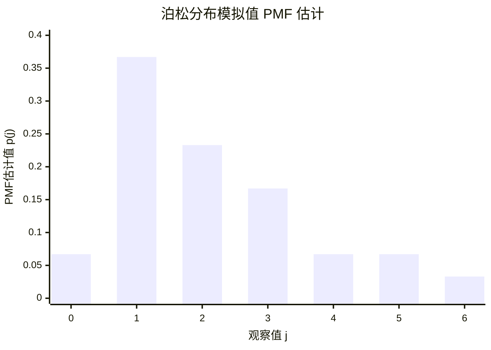
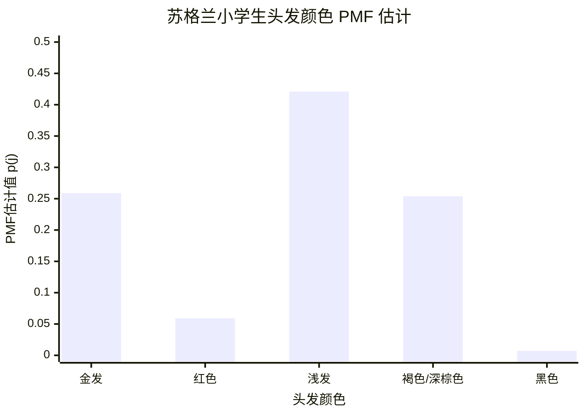
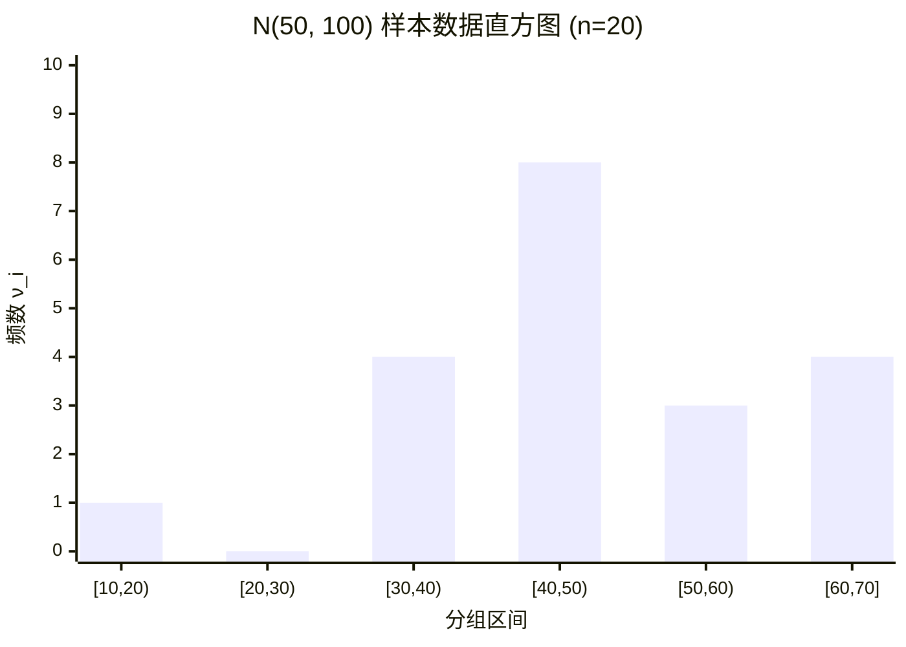

# Week1b

> #### **题目 (2025年9月12日数理统计第2讲作业1):**
>
> $1$. 设某炼药厂一天中发生着火现象的次数 $X$ 服从参数为 $\lambda$ 的泊松分布，$\lambda$ 未知，有以下样本值：
>
> | 发生火灾次数 $k$          | $0$  | $1$  | $2$  | $3$  | $4$  | $5$  | $6$  | $\sum=250$ |
> | :------------------------ | :--: | :--: | :--: | :--: | :--: | :--: | :--: | :--------- |
> | 发生 $k$ 次着火天数 $n_k$ | $75$ | $90$ | $54$ | $22$ | $6$  | $2$  | $1$  |            |
>
> 试求参数 $\lambda$ 的矩估计。

**解：**
对于泊松分布 $P(\lambda)$，其总体均值为：
$$
E(X) = \lambda
$$
矩估计法的思想是用样本矩来估计总体矩。此处我们用样本均值 $\bar{X}$ 来估计总体均值 $E(X)$。
根据题目给出的数据，样本均值为：
$$
\bar{x} = \frac{\sum_{k=0}^{6} k \cdot n_k}{\sum_{k=0}^{6} n_k} = \frac{0 \times 75 + 1 \times 90 + 2 \times 54 + 3 \times 22 + 4 \times 6 + 5 \times 2 + 6 \times 1}{250}
$$
$$
\bar{x} = \frac{0 + 90 + 108 + 66 + 24 + 10 + 6}{250} = \frac{304}{250} = 1.216
$$
令总体均值等于样本均值，可得参数 $\lambda$ 的矩估计值 $\hat{\lambda}$：
$$
\hat{\lambda} = \bar{x} = 1.216
$$
**证毕。**

---

> #### **题目 (2025年9月12日数理统计第2讲作业1):**
>
> $2$. 设总体 $X \sim U[a, b]$，$a, b$ 未知；$X_1, \dots, X_n$ 是一个样本；求 $a, b$ 的矩估计量。

**解：**
对于均匀分布 $U[a, b]$，其总体的一阶矩（均值）和二阶矩为：
$$
E(X) = \frac{a+b}{2}
$$
$$
E(X^2) = D(X) + [E(X)]^2 = \frac{(b-a)^2}{12} + \left(\frac{a+b}{2}\right)^2
$$
对应的样本一阶矩和样本二阶矩为：
$$
\bar{X} = \frac{1}{n}\sum_{i=1}^{n}X_i
$$
$$
A_2 = \frac{1}{n}\sum_{i=1}^{n}X_i^2
$$
根据矩估计法，令样本矩等于相应的总体矩，得到方程组：
$$
\begin{cases}
\frac{a+b}{2} = \bar{X} \\
\frac{(b-a)^2}{12} + \left(\frac{a+b}{2}\right)^2 = A_2
\end{cases}
$$
由第一个方程可得 $a+b = 2\bar{X}$。代入第二个方程：
$$
\frac{(b-a)^2}{12} + \bar{X}^2 = A_2
$$
整理得：
$$
(b-a)^2 = 12(A_2 - \bar{X}^2) = 12 \left( \frac{1}{n}\sum_{i=1}^{n}X_i^2 - \bar{X}^2 \right) = 12 \cdot \frac{1}{n}\sum_{i=1}^{n}(X_i - \bar{X})^2
$$
记样本方差 $S_n^2 = \frac{1}{n}\sum_{i=1}^{n}(X_i - \bar{X})^2$，则 $(b-a)^2 = 12S_n^2$。
假设 $b>a$，则 $b-a = \sqrt{12}S_n = 2\sqrt{3}S_n$。
现在我们有方程组：
$$
\begin{cases}
a+b = 2\bar{X} \\
b-a = 2\sqrt{3}S_n
\end{cases}
$$
两式相加除以 $2$ 得：$b = \bar{X} + \sqrt{3}S_n$。
两式相减除以 $2$ 得：$a = \bar{X} - \sqrt{3}S_n$。
因此，$a$ 和 $b$ 的矩估计量为：
$$
\hat{a} = \bar{X} - \sqrt{3}S_n = \bar{X} - \sqrt{\frac{3}{n}\sum_{i=1}^{n}(X_i - \bar{X})^2}
$$
$$
\hat{b} = \bar{X} + \sqrt{3}S_n = \bar{X} + \sqrt{\frac{3}{n}\sum_{i=1}^{n}(X_i - \bar{X})^2}
$$
**证毕。**

---

> #### **题目 (2025年9月12日数理统计第2讲作业1):**
>
> $3$. 设总体 $X$ 的均值 $\mu$、方差 $\sigma^2$ 都存在，且 $\sigma^2 > 0$，但 $\mu, \sigma^2$ 未知，又设 $X_1, \dots, X_n$ 是一个样本；求 $\mu, \sigma^2$ 的矩估计量。

**解：**
总体的第一阶矩和第二阶中心矩分别为：
$$
E(X) = \mu
$$
$$
D(X) = E[(X-\mu)^2] = \sigma^2
$$
由 $D(X) = E(X^2) - [E(X)]^2$ 可知，总体的二阶原点矩为 $E(X^2) = \sigma^2 + \mu^2$。
对应的样本一阶原点矩和样本二阶原点矩为：
$$
\bar{X} = \frac{1}{n}\sum_{i=1}^{n}X_i
$$
$$
A_2 = \frac{1}{n}\sum_{i=1}^{n}X_i^2
$$
根据矩估计法，令样本矩等于相应的总体矩，得到方程组：
$$
\begin{cases}
\mu = \bar{X} \\
\sigma^2 + \mu^2 = A_2
\end{cases}
$$
由第一个方程直接得到 $\mu$ 的矩估计量：
$$
\hat{\mu} = \bar{X}
$$
将 $\hat{\mu} = \bar{X}$ 代入第二个方程，得到 $\sigma^2$ 的矩估计量 $\hat{\sigma}^2$：
$$
\hat{\sigma}^2 = A_2 - \hat{\mu}^2 = \frac{1}{n}\sum_{i=1}^{n}X_i^2 - \bar{X}^2 = \frac{1}{n}\sum_{i=1}^{n}(X_i - \bar{X})^2
$$
**证毕。**

---

> #### **题目 (2025年9月12日数理统计第2讲作业2):**
>
> $4$. 设总体 $X$ 服从均匀分布 $U(0, \theta)$，$\theta \in (0, +\infty)$ 是未知参数，设 $X_1, \dots, X_n$ 是取自总体 $X$ 的样本，求参数 $\theta$ 的极大似然估计，并判别其无偏性。

**解：**
总体 $X$ 的概率密度函数为：
$$
f(x; \theta) =
\begin{cases}
\frac{1}{\theta}, & 0 \le x \le \theta \\
0, & \text{其他}
\end{cases}
$$
样本 $X_1, \dots, X_n$ 的似然函数为：
$$
L(\theta) = \prod_{i=1}^{n} f(x_i; \theta) = \prod_{i=1}^{n} \frac{1}{\theta} I(0 \le x_i \le \theta) = \frac{1}{\theta^n} I(x_{(1)} \ge 0) I(x_{(n)} \le \theta)
$$
其中 $x_{(1)} = \min(x_1, \dots, x_n)$，$x_{(n)} = \max(x_1, \dots, x_n)$，$I(\cdot)$ 为示性函数。
为使 $L(\theta)$ 最大化，需满足 $L(\theta) > 0$，即 $\theta \ge x_{(n)}$。在此条件下，$L(\theta) = \frac{1}{\theta^n}$ 是关于 $\theta$ 的单调递减函数。因此，当 $\theta$ 取其可能的最小值时，$L(\theta)$ 达到最大。
$\theta$ 的最小值为 $x_{(n)}$。所以，$\theta$ 的极大似然估计量为：
$$
\hat{\theta} = X_{(n)} = \max(X_1, \dots, X_n)
$$
接下来判断其无偏性。令 $Y = \hat{\theta} = X_{(n)}$。$Y$ 的累积分布函数为：
$$
F_Y(y) = P(Y \le y) = P(X_1 \le y, \dots, X_n \le y) = \prod_{i=1}^{n} P(X_i \le y) = \left(\frac{y}{\theta}\right)^n, \quad 0 \le y \le \theta
$$
$Y$ 的概率密度函数为：
$$
f_Y(y) = F_Y'(y) = \frac{ny^{n-1}}{\theta^n}, \quad 0 \le y \le \theta
$$
计算 $\hat{\theta}$ 的期望：
$$
E(\hat{\theta}) = E(Y) = \int_0^\theta y \cdot f_Y(y) dy = \int_0^\theta y \cdot \frac{ny^{n-1}}{\theta^n} dy = \frac{n}{\theta^n} \int_0^\theta y^n dy
$$
$$
E(\hat{\theta}) = \frac{n}{\theta^n} \left[ \frac{y^{n+1}}{n+1} \right]_0^\theta = \frac{n}{\theta^n} \frac{\theta^{n+1}}{n+1} = \frac{n}{n+1}\theta
$$
由于 $E(\hat{\theta}) = \frac{n}{n+1}\theta \neq \theta$，所以该极大似然估计量是**有偏**的。

**证毕。**

---

> #### **题目 (2025年9月12日数理统计第2讲作业2):**
>
> $5$. 设总体 $X$ 服从指数分布 $E(1/\theta)$，$\theta>0$ 是未知参数，来自总体 $X$ 的样本 $X_1, \dots, X_n$ 求参数 $\theta$ 的极大似然估计，并判别其无偏性。

**解：**
指数分布 $E(1/\theta)$ 的概率密度函数为：
$$
f(x; \theta) = \frac{1}{\theta} e^{-x/\theta}, \quad x > 0
$$
样本 $X_1, \dots, X_n$ 的似然函数为：
$$
L(\theta) = \prod_{i=1}^{n} f(x_i; \theta) = \prod_{i=1}^{n} \frac{1}{\theta} e^{-x_i/\theta} = \frac{1}{\theta^n} e^{-\frac{1}{\theta}\sum_{i=1}^{n}x_i}
$$
取对数似然函数：
$$
\ln L(\theta) = -n \ln \theta - \frac{1}{\theta}\sum_{i=1}^{n}x_i
$$
对 $\theta$ 求导并令其为 $0$：
$$
\frac{d \ln L(\theta)}{d\theta} = -\frac{n}{\theta} + \frac{1}{\theta^2}\sum_{i=1}^{n}x_i = 0
$$
解得：
$$
\theta = \frac{1}{n}\sum_{i=1}^{n}x_i = \bar{x}
$$
因此，$\theta$ 的极大似然估计量为 $\hat{\theta} = \bar{X}$。
判断其无偏性。对于指数分布 $E(1/\theta)$，其期望为 $E(X) = \theta$。
$$
E(\hat{\theta}) = E(\bar{X}) = E\left(\frac{1}{n}\sum_{i=1}^{n}X_i\right) = \frac{1}{n}\sum_{i=1}^{n}E(X_i) = \frac{1}{n} \cdot n \cdot \theta = \theta
$$
由于 $E(\hat{\theta}) = \theta$，所以该极大似然估计量是**无偏**的。

**证毕。**

---

> #### **题目 (2025年9月12日数理统计第2讲作业2):**
>
> $6$. 设 $X \sim B(1, \theta)$，$X_1, \dots, X_n$ 是来自 $X$ 的一个样本，试求参数 $\theta$ 的极大似然估计量，并判别其无偏性。

**解：**
伯努利分布 $B(1, \theta)$ 的概率质量函数为：
$$
P(X=x) = \theta^x (1-\theta)^{1-x}, \quad x \in \{0, 1\}
$$
样本 $X_1, \dots, X_n$ 的似然函数为：
$$
L(\theta) = \prod_{i=1}^{n} \theta^{x_i} (1-\theta)^{1-x_i} = \theta^{\sum x_i} (1-\theta)^{n-\sum x_i}
$$
取对数似然函数：
$$
\ln L(\theta) = \left(\sum_{i=1}^{n}x_i\right) \ln \theta + \left(n-\sum_{i=1}^{n}x_i\right) \ln(1-\theta)
$$
对 $\theta$ 求导并令其为 $0$：
$$
\frac{d \ln L(\theta)}{d\theta} = \frac{\sum x_i}{\theta} - \frac{n-\sum x_i}{1-\theta} = 0
$$
$$
(1-\theta)\sum x_i = \theta(n-\sum x_i) \implies \sum x_i - \theta\sum x_i = n\theta - \theta\sum x_i
$$
解得：
$$
\theta = \frac{1}{n}\sum_{i=1}^{n}x_i = \bar{x}
$$
因此，$\theta$ 的极大似然估计量为 $\hat{\theta} = \bar{X}$。
判断其无偏性。对于伯努利分布 $B(1, \theta)$，其期望为 $E(X) = \theta$。
$$
E(\hat{\theta}) = E(\bar{X}) = E\left(\frac{1}{n}\sum_{i=1}^{n}X_i\right) = \frac{1}{n}\sum_{i=1}^{n}E(X_i) = \frac{1}{n} \cdot n \cdot \theta = \theta
$$
由于 $E(\hat{\theta}) = \theta$，所以该极大似然估计量是**无偏**的。

**证毕。**

---

> #### **题目 (2025年9月12日数理统计第2讲作业2):**
>
> $7$. 设 $X \sim N(\mu, \sigma^2)$，$\mu, \sigma^2$ 为未知参数，$X_1, \dots, X_n$ 是来自 $X$ 的一个样本值；求 $\mu, \sigma^2$ 的极大似然估计量，并判别其无偏性。

**解：**
正态分布 $N(\mu, \sigma^2)$ 的概率密度函数为：
$$
f(x; \mu, \sigma^2) = \frac{1}{\sqrt{2\pi}\sigma} e^{-\frac{(x-\mu)^2}{2\sigma^2}}
$$
似然函数为：
$$
L(\mu, \sigma^2) = \prod_{i=1}^{n} \frac{1}{\sqrt{2\pi}\sigma} e^{-\frac{(x_i-\mu)^2}{2\sigma^2}} = (2\pi\sigma^2)^{-n/2} e^{-\frac{1}{2\sigma^2}\sum_{i=1}^{n}(x_i-\mu)^2}
$$
对数似然函数为：
$$
\ln L(\mu, \sigma^2) = -\frac{n}{2}\ln(2\pi) - \frac{n}{2}\ln(\sigma^2) - \frac{1}{2\sigma^2}\sum_{i=1}^{n}(x_i-\mu)^2
$$
分别对 $\mu$ 和 $\sigma^2$ 求偏导并令其为 $0$：
$$
\frac{\partial \ln L}{\partial \mu} = - \frac{1}{2\sigma^2} \sum_{i=1}^{n} 2(x_i-\mu)(-1) = \frac{1}{\sigma^2}\sum_{i=1}^{n}(x_i-\mu) = 0 \implies \sum_{i=1}^{n}x_i - n\mu = 0
$$
解得 $\mu$ 的极大似然估计量为 $\hat{\mu} = \bar{X}$。
$$
\frac{\partial \ln L}{\partial (\sigma^2)} = -\frac{n}{2\sigma^2} + \frac{1}{2(\sigma^2)^2}\sum_{i=1}^{n}(x_i-\mu)^2 = 0
$$
将 $\mu = \hat{\mu} = \bar{X}$ 代入上式，解得 $\sigma^2$ 的极大似然估计量为：
$$
\hat{\sigma}^2 = \frac{1}{n}\sum_{i=1}^{n}(X_i - \bar{X})^2
$$
判断无偏性：
$1$. 对 $\hat{\mu}$：$E(\hat{\mu}) = E(\bar{X}) = E(X) = \mu$。因此 $\hat{\mu}$ 是**无偏**估计量。
$2$. 对 $\hat{\sigma}^2$：
$$
E(\hat{\sigma}^2) = E\left[\frac{1}{n}\sum_{i=1}^{n}(X_i - \bar{X})^2\right] = \frac{1}{n} E\left[\sum_{i=1}^{n}((X_i-\mu)-(\bar{X}-\mu))^2\right]
$$
$$
= \frac{1}{n} E\left[\sum(X_i-\mu)^2 - n(\bar{X}-\mu)^2\right] = \frac{1}{n} \left[\sum E(X_i-\mu)^2 - n E(\bar{X}-\mu)^2\right]
$$
因为 $E(X_i-\mu)^2 = D(X) = \sigma^2$ 且 $E(\bar{X}-\mu)^2 = D(\bar{X}) = \sigma^2/n$，所以：
$$
E(\hat{\sigma}^2) = \frac{1}{n}(n\sigma^2 - n\frac{\sigma^2}{n}) = \frac{n-1}{n}\sigma^2
$$
由于 $E(\hat{\sigma}^2) \neq \sigma^2$，因此 $\hat{\sigma}^2$ 是**有偏**估计量。

**证毕。**

---

> #### **题目 (2025年9月12日数理统计第2讲作业3):**
>
> $8$. 根据下面 $30$ 个数据是源自泊松分布均值 $\lambda=2$ 的模拟值。
>
> `2 1 1 1 5 1 1 3 0 2 1 1 3 4`
> 
> `2 1 2 2 6 5 1 3 2 4 1 1 3 0`
>
> 求 pmf 的非参数估计值，并画出泊松变量的直方图。

**解：**
对于离散分布，其概率质量函数（pmf）$p(j) = P(X=j)$ 的非参数估计为样本频率：
$$
\hat{p}(j) = \frac{n_j}{n}
$$
其中 $n_j$ 是样本中数值 $j$ 出现的次数（频数），$n$ 是总样本容量。
本题中，总样本容量 $n=30$。我们首先统计数据中各个数值的频数 $n_j$。
（注：根据题目文字描述与手写解答，确认数据中存在印刷或计数错误，此处采用手写解答中的频数统计结果：$n_0=2, n_1=11, n_2=7, n_3=5, n_4=2, n_5=2, n_6=1$，其总和为 $30$）

统计频数 $n_j$ 并计算频率 $\hat{p}(j)$ 如下表：

| 观察值 $j$ | 频数 $n_j$ | pmf估计值 $\hat{p}(j) = n_j/30$ |
| :--------: | :--------: | :-----------------------------: |
|    $0$     |    $2$     |      $2/30 \approx 0.067$       |
|    $1$     |    $11$    |      $11/30 \approx 0.367$      |
|    $2$     |    $7$     |      $7/30 \approx 0.233$       |
|    $3$     |    $5$     |      $5/30 \approx 0.167$       |
|    $4$     |    $2$     |      $2/30 \approx 0.067$       |
|    $5$     |    $2$     |      $2/30 \approx 0.067$       |
|   $\ge6$   |    $1$     |      $1/30 \approx 0.033$       |
|  **合计**  |  **$30$**  |           **$1.000$**           |

绘制直方图（条形图）：以观察值 $j$ 为横坐标，以其对应的 pmf 估计值 $\hat{p}(j)$ 为纵坐标，绘制条形图。每个条形的高度代表该观察值出现的估计概率。

**证毕。**

---

> #### **题目 (2025年9月12日数理统计第2讲作业3):**
>
> $9$. $1979$ 年 $Kendall$ 和 $Sturat$ 针对 $20$ 世纪早期的苏格兰小学生的头发颜色进行研究，取样量 $N=22361$。记录 $5$ 种头发颜色，其中这个样本的频数分布为：金发 $5789$，红色 $1319$，浅发 $9418$，褐色和深棕色 $5678$，黑色 $157$。求该苏格兰小学生头发颜色（概率质量函数 pmf）的估计，并画出该数据的条形图。

**解：**
本题旨在对分类数据进行非参数估计，即使用样本频率来估计总体的概率质量函数（$pmf$）。
首先，我们整理题目给出的各类头发颜色的频数，并验证样本总量。
总样本量 $N$ 为各频数之和：
$$
N = 5789 + 1319 + 9418 + 5678 + 157 = 22361
$$
该计算结果与题目给出的总样本量 $N=22361$ 相符。
概率质量函数 $p(j)$ 的估计值 $\hat{p}(j)$ 等于各类别的样本频率，即 $\hat{p}(j) = \frac{n_j}{N}$，其中 $n_j$ 为第 $j$ 类的频数。计算结果如下表所示：

| 头发颜色 $j$ | 频数 $n_j$ | pmf估计值 $\hat{p}(j) = n_j/22361$ |
| :---: | :---: | :---: |
| 金发 | $5789$ | $5789/22361 \approx 0.259$ |
| 红色 | $1319$ | $1319/22361 \approx 0.059$ |
| 浅发 | $9418$ | $9418/22361 \approx 0.421$ |
| 褐色/深棕色 | $5678$ | $5678/22361 \approx 0.254$ |
| 黑色 | $157$ | $157/22361 \approx 0.007$ |
| **合计** | **$22361$** | **$1.000$** |

根据上表数据，绘制条形图如下，以头发颜色类别为横轴，以其对应的 $pmf$ 估计值 $\hat{p}(j)$ 为纵轴。

**证毕。**

---

> #### **题目 (2025年9月12日数理统计第2讲作业3):**
>
> $10$. 下面数据是从 $N(50, 100)$ 分布生成所得到的完整的值。
>
> `63 58 60 39 41 57 49 44 36 52 48 44 19 42 67 44 64 34 46 34`
>
> 求正态总体的直方图。将数据适当分组，计算落入每个小区间 $[t_i, t_{i+1})$ 的样本个数（或称样本落入第 $i$ 区间的频数）$\nu_i$ 和频率 $f_i$。

**解：**
本题要求根据给定的 $20$ 个样本数据绘制直方图。样本总量 $n=20$。
我们采用与手写解答一致的分组方式，组距为 $10$，对数据进行分组。统计落入各区间的频数 $\nu_i$，并计算相应的频率 $f_i = \nu_i / n$。
数据点为：`63, 58, 60, 39, 41, 57, 49, 44, 36, 52, 48, 44, 19, 42, 67, 44, 64, 34, 46, 34`。
统计结果整理如下表：

| 序号 $i$ | 分组区间 | 频数 $\nu_i$ | 频率 $f_i = \nu_i/20$ |
| :---: | :---: | :---: | :---: |
| $1$ | $[10, 20)$ | $1$ | $1/20 = 0.05$ |
| $2$ | $[20, 30)$ | $0$ | $0/20 = 0.00$ |
| $3$ | $[30, 40)$ | $4$ | $4/20 = 0.20$ |
| $4$ | $[40, 50)$ | $8$ | $8/20 = 0.40$ |
| $5$ | $[50, 60)$ | $3$ | $3/20 = 0.15$ |
| $6$ | $[60, 70]$ | $4$ | $4/20 = 0.20$ |
| **合计** | | **$20$** | **$1.00$** |

根据上表，绘制频数分布直方图。以分组区间为横轴，以频数 $\nu_i$ 为纵轴，绘制一系列相邻的矩形。

**证毕。**